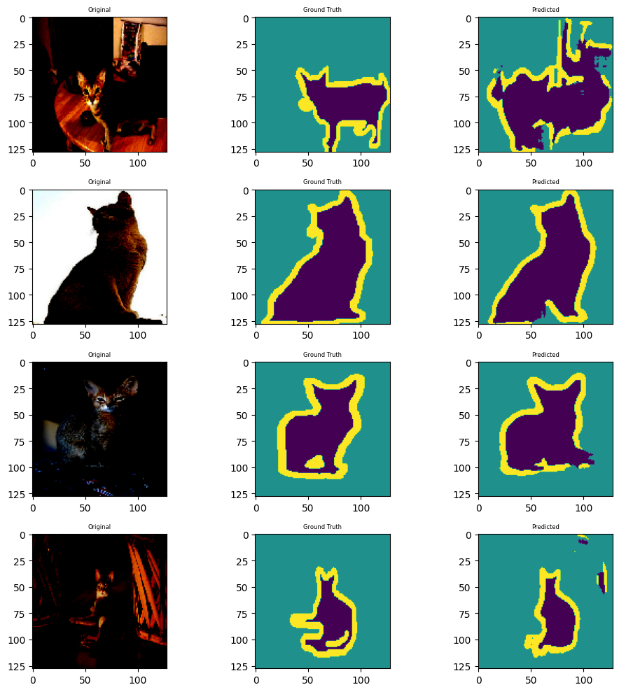
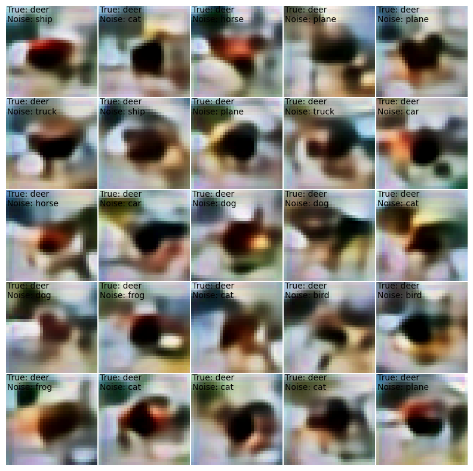

# Session 22 - UNET and VAE

## Project Repo

### Objective
1. First Objective 
To complete the first part of your assignment, you will train your own UNet from scratch. You can refer to this [Blog](https://medium.com/geekculture/u-net-implementation-from-scratch-using-tensorflow-b4342266e406) for the [Dataset](https://www.kaggle.com/datasets/tanlikesmath/the-oxfordiiit-pet-dataset) and strategy. However, you need to train it four times using the following configurations:

    1. MP+Tr+BCE
    2. MP+Tr+Dice Loss
    3. StrConv+Tr+BCE
    4. StrConv+Ups+Dice Loss

2. Second Objective

For the second objective, you will train a VAE using the following datasets:

- MNIST
- CIFAR10

## Result

### 1. Example of prediction using UNet 

### 2. VAE

    A. MNIST --> Input image + 25 different iterations of wrong label

    B. CIFAR10 --> Input image + 25 different iterations of wrong label

